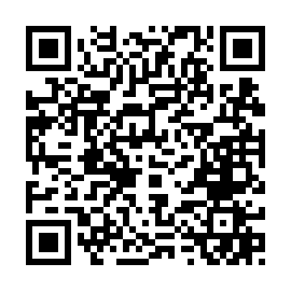

# LINE Emotion Classification Bot  
（LINE 情緒分類 AI Bot）

透過 HuggingFace DistilBERT + FastAPI + Cloudflare Tunnel 架設的情緒分類聊天機器人。  
下方 QR Code 可直接加入 LINE Bot。

日本語補助：下の QR を読み取ると、そのまま LINE Bot に友だち追加できます。

---

## 📱 加入 LINE Bot（Scan QR）

或直接點擊以下連結加入：  
[加入 LINE Bot](https://line.me/R/ti/p/xxxxxxxxxx)

---

## 🔍 Bot 功能说明  
- 使用 **DistilBERT** 微調 Twitter Emotion Dataset  
- 支援 **anger / joy / fear / sadness / love / surprise**  
- 透過 FastAPI 部署推論 API  
- 整合 LINE Messaging API 進行雙向溝通  
- 部署於 AWS EC2，並使用 Cloudflare Tunnel 提供 HTTPS 公開端點

日本語  
・DistilBERT を fine-tuning  
・FastAPI + Cloudflare Tunnel  
・LINE Webhook と連携  
・EC2 上で安定稼働

---

## 🧪 Demo Example  
使用範例：

